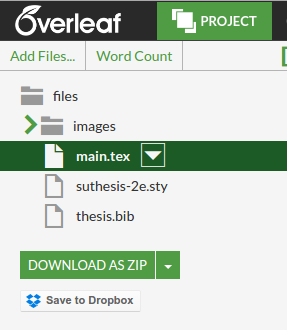

Thesis HTML Generator
====================

This simple Dockerfile will take an Overleaf extracted thesis (a zip file with some main.tex file, images, etc.) and use [hdlatex]() to render a simple HTML view for reading the thesis. The installation of latex, etc. and the generation of the static files is done via Docker so the user does not need to worry about installing dependencies. The idea is that if you fork the repo, you can then push the files to your gh-pages branch and **wha-la** you have your thesis as a simple website for sharing!

### Instructions

First, fork the repo to your Github by clicking on the fork button. Then clone the repo.

      git clone https://www.github.com/{{username}}/thesis
      cd thesis
      
Next, you need to download your thesis in zip format from Overleaf. They have a nice button to do this:

You should plop it in this folder, making sure to delete mine (if I've included it in the repo, I maybe haven't until I properly submit it!). The script will find your thesis based on it having the `.zip` extension. If you don't have a zip file, it's going to get angry at you.

Then, you need to run the Docker image. You can either build it locally, or run the version from Dockerhub. I would suggest building locally, but it's up to you:

      docker build -t vanessa/thesis .
      docker run vanessa/thesis

This will generate a simple version of your thesis, in site form, in a folder called `site` in the present working directory. It will also produce an `index.html` in the present working directory that will redirect to the main `.html` file in your site folder automatically. Then you simple need to add these files to a github pages branch.

      git checkout -b gh-pages
      git add site/
      git add index.html
      git push origin gh-pages

Then, your site should be available at `{{username}}.github.io/thesis`. 

### Anticipated Issues
I would imagine that University / Institution templates are different. My zipped up thesis only contains a bibliography (thesis.bib), one main `.tex` file (main.tex), a folder of images (`/images`) and a style file (`suthesis-2e.sty`). Thus, my program makes a few assumptions that might need tweaking if your zip is different:

By default, the first .tex file found via `glob` is assumed to be the main thesis to render. If you have something like supplementary material or else, the fix to this would be to modify the [generate.py](generate.py) script to take the name of this file as first argument instead of finding programatically. Then you would add that name to the file generate.sh before running:

      python generate.py mainfile.tex
 
In the same way, if you have more than one zip file in your folder, it will select the first. This could also be an argument added to the two generate scripts.

Finally, in my tests I am seeing some of the early sections get generated more than once (eg, a duplicate "Abstract" section). I haven't looked into this yet, and will in the future.

### Coming Soon
I am going to add some custom style files to give the thesis a bit of branding, and a bit of... say... style? :)

### Help and Features

If you want me to add or change something, please don't hesitate to post on the [issues board](https://github.com/vsoch/thesis/issues).

### License
[MIT](LICENSE)
